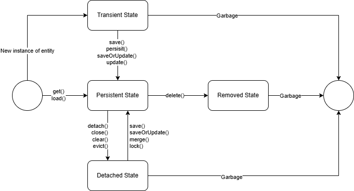
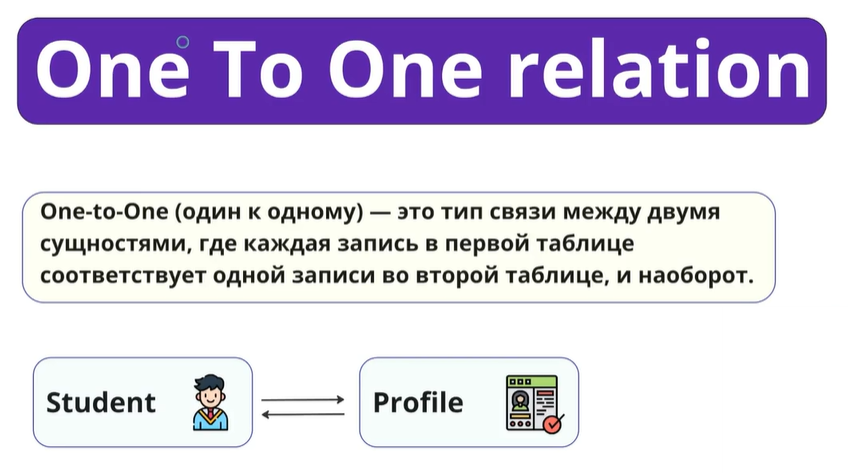
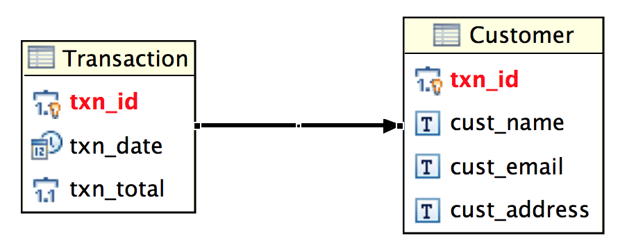
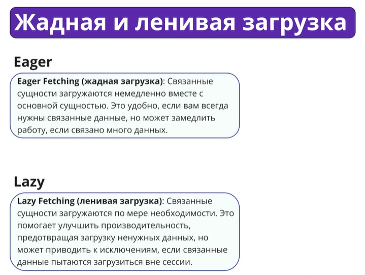
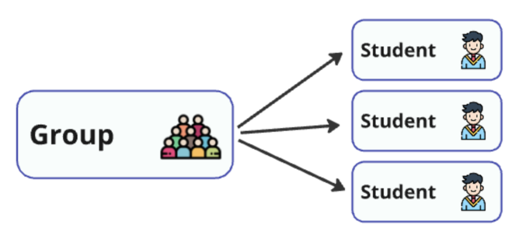
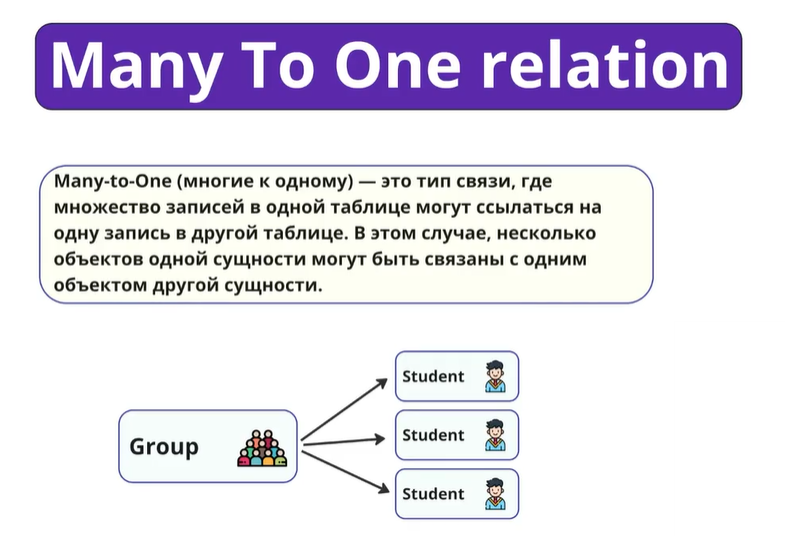
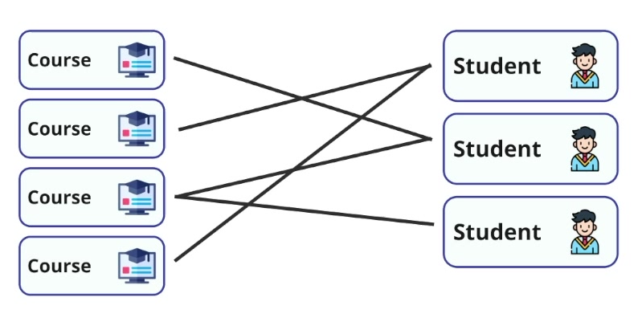
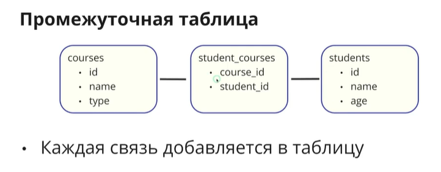

## Уроки по Hibernate

Это проект для практики уроков по Hibernate, взятых из https://stepik.org/course/264362/
от Павла Сорокина.

## Ссылка на репозиторий - https://github.com/sorokin-school/hibernate-lessons/tree/main

## 2.3 Основы Hibernate
### 📝 Создание Hibernate сущностей

В этом уроке мы рассмотрели, как превратить обычные Java-классы в сущности Hibernate, которые могут быть сохранены в базу данных. Сущность (Entity) — это основной строительный блок в Hibernate, представляющий собой объект, который может быть сопоставлен с записью в таблице базы данных.

### Требования к JPA сущностям

Чтобы Java-класс стал сущностью Hibernate, необходимо выполнить несколько требований:

- Аннотация `@Entity`: Класс должен быть помечен аннотацией `@Entity`, которая указывает Hibernate, что этот класс является сущностью и должен быть связан с таблицей в базе данных.
- Конструктор без аргументов: Сущности должны иметь конструктор без аргументов, который Hibernate будет использовать для создания экземпляров класса.
- Сеттеры для свойств: Для всех полей класса должны быть определены сеттеры (или публичные поля), чтобы Hibernate мог задавать значения этим полям при загрузке данных из базы данных.


### 📝 Аннотации @Entity, @Table, @Column, @Id
- `@Entity`: Указывает, что данный класс является сущностью. Hibernate будет маппить этот класс на таблицу в базе данных.
- `@Table`: Эта аннотация используется для указания имени таблицы, с которой должна быть связана сущность. Если аннотация не указана, Hibernate будет использовать имя класса в качестве имени таблицы.
- `@Column`: Используется для указания имени колонки в таблице базы данных, которая будет соответствовать полю класса. Также позволяет задавать дополнительные параметры, такие как длина строки, уникальность, и обязательность.
- `@Id`: Указывает первичный ключ таблицы. Hibernate будет использовать это поле как идентификатор сущности в базе данных.

### CRUD операции

`CRUD (Create, Read, Update, Delete)` — это четыре основных операции, которые позволяют взаимодействовать с данными в базе данных. Рассмотрим каждую операцию подробнее:

- **Создание (Create)**: Операция создания новой записи в базе данных. В Hibernate для этого используется метод `save()` или `persist()`.
```java
// Создаем объект Student
Student student = new Student("john_doe", 22);
// Сохраняем объект в базе данных
session.save(student);
```

- **Чтение (Read)**: Операция чтения или получения данных из базы данных. В Hibernate для этого используется метод get() или load() для поиска по первичному ключу, а также HQL/JPQL-запросы для более сложных выборок.
```java
// Получаем объект Student по ID
Student student = session.get(Student.class, 1);
```
Получение всех студентов.
```java
// Получаем всех студентов с помощью HQL-запроса
List<Student> students = session.createQuery("FROM Student", Student.class).list();
```
- **Обновление (Update)**: Операция обновления существующей записи в базе данных. В Hibernate для этого используется метод update() или merge().
```java
// Обновляем возраст студента
student.setAge(23);
session.update(student);
```
- **Удаление (Delete)**: Операция удаления записи из базы данных. В Hibernate для этого используется метод delete() или remove().
```java
// Удаляем студента из базы данных
session.delete(student);
```

### Резюме урока
В этом уроке мы изучили базовые возможности Hibernate и узнали, как превращать обычные Java-классы в сущности, которые могут быть сохранены в базу данных:

- `Hibernate` — ORM-фреймворк, который позволяет работать с базой данных через Java-объекты, минимизируя ручное написание SQL.

- `Сущность (Entity)` — класс Java, который сопоставляется с таблицей базы данных. Каждая сущность соответствует одной строке в таблице.


- `Требования к JPA-сущностям:`
  - `@Entity` — класс помечается как сущность.
  - `Конструктор без аргументов` — необходим Hibernate для создания объекта.
  - `Сеттеры или публичные поля` — нужны для заполнения данных из БД.

- Основные аннотации Hibernate:
  - `@Entity` — делает класс сущностью.
  - `@Table` — позволяет указать имя таблицы (если не указано, используется имя класса).
  - `@Column` — задаёт имя и свойства колонки таблицы.
  - `@Id` — отмечает поле первичного ключа.

- `CRUD-операции` — базовый набор действий с данными:
  - `Create` — создание новой записи (session.save()).
  - `Read` — получение данных через get(), load() или HQL/JPQL.
  - `Update` — обновление существующей записи (update(), merge()).
  - `Delete` — удаление записи (delete()).

- `SQL и JPQL` — два способа строить запросы:
  - `SQL` работает напрямую с таблицами базы данных.
  - `JPQL` работает с сущностями и полями Java-классов.

---

## 2.4 Entity Lifecycle. Жизненный цикл Hibernate сущностей

- Session - это основной класс, с помощью которого мы взаимодействуем с БД (изменяем сущности, сохраняем, изменяем, делаем поиск и т.д.).

**Важные моменты:** у нашей сущности, которую мы создаем с помощью Hibernate, есть 4 состояния:

- **Transient** (создаем сущность через `new`) - объект, который не привязан к сессии и не сохранен в БД. Сущности не сохраняются в базе,
  пока не будут переданы в сессию. Она не видима для Сессии. Чтобы Hibernate смогла работать с ней и чтобы Сессия знала о ней, 
  чтобы отслеживать её, нужно её перевести в состояние Persistent. Это можно сделать с помощью методов `save()`, `update()`, 
  `saveOrUpdate()` или `persist()`. После этих команд Сессия кэширует эту сущность у себя и начинает отслеживать её.
- **Persistent** - объект, который привязан к сессии и сохранен в БД. Сущности автоматически синхронизируются с БД. Если 
  мы получим объект из БД с помощью `get()` или `load()`, то он будет в этом состоянии. Сессия уже будет знать об этом объекте.
- **Detached** (Отсоединенный от Сессии) - объект, который был сохранен в БД, но больше не привязан к сессии.
  Это можно сделать с помощью метода `detach()` или `evict()` (отсоединяем сущность от Сессии), `close()` (полностью закрываем Сессию и она больше не активна), 
  `clear()` (тут Сессия отсоединяет все сущности, которые у неё были и не за кем больше не следит).
  Из этого состояния Detached можно перейти в Persistent, чтобы Сессия снова следила за этой сущностью, за изменениями в этой сущности.
  Это можно сделать с помощью методов `merge()`, `save()`, `saveOrUpdate()`, `lock()`.
- **Removed** - объект, который был удален из БД. В это состояние можно перейти из Persistent с помощью метода `delete()`.
  Сессия об этом объекте всё знает и он помечается, как объект для удаления. И когда будет коммититься транзакция Сессия 
  отправит к БД запрос на удаление этого объекта. Сущности окончательно удаляются только после коммита транзакции.


Схема жизненного цикла сущности. Переходы между состояниями:



### 📝 Сессия в Hibernate

`Сессия (Session)` в Hibernate — это основной интерфейс для взаимодействия с базой данных. Сессия представляет собой объект, 
через который приложение общается с базой данных, управляет транзакциями и выполняет CRUD операции (создание, чтение, обновление, удаление).

#### Ключевые моменты о сессии:
Сессия является однопоточной, краткоживущей и отвечает за отслеживание изменений объектов.

- `Однопоточный объект`: Каждая сессия связана с конкретным потоком выполнения, что означает, что её нельзя безопасно использовать из нескольких потоков одновременно.
- `Короткоживущий объект`: Сессия создаётся для кратковременных операций и закрывается сразу после выполнения транзакции.
- `Управление состоянием сущностей`: Сессия управляет состояниями сущностей и их жизненным циклом.

#### 📝 Жизненный цикл сущностей
Жизненный цикл сущностей (Entity Lifecycle) — набор состояний, через которые проходит объект при работе с Hibernate.
Hibernate управляет жизненным циклом сущностей (объектов) через различные состояния, которые определяют их взаимодействие с базой данных.

**» Transient (временное состояние)**
  - Сущность находится в памяти приложения, но ещё не сохранена в базе данных и не связана с сессией Hibernate.
Пример: вы создали новый объект, но ещё не вызвали метод save() или persist().

**» Persistent (постоянное состояние)**
  - Сущность связана с активной сессией Hibernate, и любые изменения в объекте будут автоматически синхронизированы с базой данных при выполнении транзакции.
Это состояние достигается после того, как сущность была сохранена в базе данных, и сессия отслеживает её изменения.

**» Detached (отсоединённое состояние)**
  - Сущность была ранее связана с сессией, но теперь сессия закрыта или объект был отделён от сессии. Hibernate больше не отслеживает изменения в этом объекте.
Пример: вы закрыли сессию, но всё ещё имеете ссылку на объект.

**» Removed (удалённое состояние)**
  - Сущность была связана с сессией и помечена для удаления, но ещё не удалена из базы данных. Объект будет удалён из базы данных при завершении транзакции.


#### 📝 Важные моменты

- `Transient` сущности не хранятся в базе данных и будут потеряны при завершении работы программы, если не сохранены в сессии.
- `Persistent` сущности автоматически сохраняют свои изменения в базе данных, что делает их удобными для работы в транзакциях.
- `Detached` сущности можно снова связать с сессией через методы, такие как update() или merge(), чтобы Hibernate снова начал отслеживать их изменения.
- `Removed` сущности исчезнут из базы данных после завершения транзакции, что следует учитывать при удалении объектов.

```
Transient (временное состояние)
— сущность существует только в памяти приложения и не связана с сессией;
— объект ещё не сохранён в базу данных.

Persistent (постоянное состояние)
— сущность связана с активной сессией Hibernate;
— любые изменения объекта будут автоматически сохранены в базе данных при фиксации транзакции.

Detached (отсоединённое состояние)
— объект ранее был persistent, но сессия закрыта или сущность была отсоединена;
— изменения больше не отслеживаются Hibernate.

Removed (удалённое состояние)
— сущность помечена для удаления и будет удалена из базы данных при завершении транзакции.
```

---

## 2.5 Связь One-To-One между сущностями

One-to-One:


One-to-One связь не гарантирует, что у сущности будет одна связь, этой связи может не быть.
Например, у сущности Student есть один Профиль (Profile), но этой связи может и не быть, если Профиль не заполнен.
Для каждого студента есть не более 1 профиля. И для каждого профиля есть не более 1 студента.  


### 📝 Что такое One-to-One связь?



`One-to-One (один к одному)` — это тип связи между двумя сущностями, где каждая запись одной таблицы связана ровно с 
одной записью другой таблицы. В реляционной базе данных такая связь реализуется с помощью внешнего ключа (foreign key), 
который указывает на запись другой таблицы.
В реальном мире такой тип связи можно представить, например, как связь между пользователем и его профилем. Каждый 
пользователь имеет ровно один профиль, и каждый профиль принадлежит только одному пользователю.


Связь `One-to-One` — это отношение, при котором одной записи в таблице соответствует ровно одна запись в другой таблице.
Пример: `Пользователь — Профиль`, `Человек — Паспорт`.


### 📝 Настройка One-to-One связи в Java коде

Для настройки связи `One-to-One` в Hibernate используется аннотация `@OneToOne` в сочетании с `@JoinColumn`.

- `@OneToOne`: Эта аннотация указывает на то, что данное поле связано с другой сущностью в отношении "один к одному".
- `@JoinColumn`: Эта аннотация используется для указания столбца, который будет служить внешним ключом (FK) и связывать записи между таблицами.


Пример настройки:
Класс Student:
```java
@Entity
@Table(name = "students")
public class Student {

    @OneToOne(mappedBy = "student", cascade = CascadeType.REMOVE)
    private Profile profile;

    //остальные поля
```
Класс Profile:
```java
@Entity
@Table(name = "profiles")
public class Profile {

    @OneToOne
    @JoinColumn(name = "student_id", referencedColumnName = "id")
    private Student student;

    //остальные поля
```


### 📝 Работа с базой данных и внешними ключами (FK)

Когда вы настраиваете связь One-to-One в базе данных, важно понимать, как работает внешняя ссылка (foreign key).

- `Foreign Key (FK)`: Это специальное ограничение в базе данных, которое обеспечивает ссылочную целостность. 
  FK гарантирует, что в связанной таблице всегда существует запись, на которую ссылается внешняя ссылка.
- Если попытаться удалить запись в одной таблице, на которую ссылается другая таблица через FK, то база данных не 
  позволит это сделать, пока не будет удалена или изменена соответствующая запись.

Например, если у пользователя есть профиль, и вы попытаетесь удалить профиль без удаления ссылки на него из таблицы студентов, 
то база данных выдаст ошибку.

### 📝 Каскадные операции

Каскадные операции управляют тем, как операции (сохранение, удаление, обновление) на основной сущности воздействуют на 
связанную сущность. В Hibernate это настраивается через параметр `cascade` аннотации `@OneToOne`.
Типы каскадных операций:

- `CascadeType.PERSIST`: При сохранении основной сущности, автоматически сохраняется и связанная сущность.
- `CascadeType.REMOVE`: При удалении основной сущности, автоматически удаляется и связанная сущность.
- `CascadeType.MERGE`: Изменения в основной сущности также применяются и к связанной сущности.
- `CascadeType.REFRESH`: При обновлении основной сущности из базы данных, также обновляется и связанная сущность.
- `CascadeType.ALL`: Применяет все вышеуказанные каскадные операции.


### 📝 Основные типы реализации One-to-One связи:

- Через внешний ключ (Foreign Key) — когда одна таблица хранит ссылку на другую с помощью `@JoinColumn`.
- Через двустороннюю связь — когда одна сущность является владельцем связи (`owner side`), а 
  другая — обратной стороной (`inverse side`) с аннотацией `mappedBy`.

### 📝 Ключевые аннотации One-to-One:

- `@OneToOne` — указывает на связь один к одному между сущностями.
- `@JoinColumn` — задаёт имя колонки внешнего ключа (используется на стороне владельца).
- `mappedBy` — указывает, что связь управляется другой сущностью.
- `cascade = ...` — позволяет управлять каскадными операциями.
- `fetch = ...` — задаёт стратегию загрузки (`LAZY` или `EAGER`).


### 📝 Владелец связи
— сущность, у которой стоит `@JoinColumn`. Именно она управляет записью внешнего ключа FK в базе.

### 📝 Каскадирование
— механизм, позволяющий автоматически сохранять, обновлять или удалять связанную сущность (например, сохранять пользователя вместе с его профилем).


### 📝 Типы загрузки (Жадная и ленивая загрузка):

- `Жадная (Eager) и ленивая (Lazy) загрузка` — это стратегии загрузки связанных данных в Hibernate. 
  Они определяют, когда связанные сущности будут загружены из базы данных.
- `LAZY`  (ленивая) загрузка — объект загружается только при обращении к нему; предпочтительный способ. Например, когда мы делаем запрос на 
  получение Группы, то список студентов не сразу подтягивается, а только тогда, когда мы к нему обращаемся.
  Но при этом, может возникать LazyInitializationException, если мы попытаемся обратиться к полю (загрузить связанные сущности), 
  когда Сессия была уже закрыта.
  Связанные сущности загружаются только по мере необходимости, т.е. когда вы впервые обращаетесь к полю, представляющему 
  связанную сущность. Это экономит ресурсы, но может вызвать проблемы, если сессия уже закрыта к моменту обращения к 
  связанным данным. Если после завершения сессии вы попытаетесь получить доступ к связанным сущностям, возникнет исключение 
  LazyInitializationException, так как сессия и невозможно сделать загрузку.
- `EAGER`  (жадная) загрузка — объект загружается сразу, что может привести к лишним запросам. Т.к. запрос с join выполняется немного дольше, чем без него.
  Связанные сущности загружаются сразу же вместе с основной сущностью. Это удобно, когда вы всегда хотите работать с данными 
  всех связанных сущностей. Однако это может привести к избыточной загрузке данных, если связанная сущность не всегда нужна.
  Может привести к перегрузке запросами.



---

## 2.6 Связь Many-To-One между сущностями
### 📝 Что означает связь Many-to-One
`Many-to-One (многие к одному)` — это тип связи между двумя сущностями, где множество записей одной таблицы могут быть 
связаны с одной записью другой таблицы. В реляционных базах данных такая связь часто используется для отображения отношений, 
где одна запись представляет собой `родительскую запись`, а множество записей — `дочерние`.

Связь `Many-to-One` — это отношение, при котором множество записей одной таблицы могут быть связаны с одной записью другой таблицы.
Пример: `многие студенты` — `одна группа`, `многие заказы` — `один пользователь`.

>Внешний ключ FK при связи `One-to-Many` / `Many-to-One` хранится на стороне Многих!!!



В Java-коде такая связь задается с использованием аннотации `@ManyToOne` **в дочерней сущности**, с указанием `@JoinColumn` - по какой 
колонке необходимо делать маппинг. В дочерней сущности используется аннотация `@ManyToOne` — она указывает, что текущая сущность относится к одной родительской.
Через `@JoinColumn` задаётся колонка во внешнем ключе, по которой Hibernate выполняет маппинг.
В **основной сущности** используется аннотация `@OneToMany` с указанием по какому полю дочерней сущности необходимо делать маппинг.
В **родительской сущности** связь отражается через `@OneToMany` с параметром `mappedBy`, чтобы указать, какое поле в дочерней сущности является владельцем.

`Group` - основная сущность:
```java
@Entity
@Table(name = "student_group")
public class Group {

    @OneToMany(mappedBy = "group", fetch = FetchType.EAGER) //указываем по какому полю дочерней сущности необходимо делать маппинг.
    private List<Student> studentList;
    
    // остальные поля

```

Student - дочерняя сущность:
```java
@Entity 
@Table(name = "students")
public class Student {

    @ManyToOne
    @JoinColumn(name = "group_id") //по какой колонке необходимо делать маппинг.
    private Group group;
    
    // остальные поля
```

### 📝 Проблема N+1 запросов

- `Проблема N+1` запросов возникает, когда для загрузки основной сущности (например, списка студентов) делается один запрос, 
  а для каждой связанной сущности (например, группы каждого студента) — отдельный запрос. Если у вас N студентов, то это 
  приведет к выполнению N+1 запросов, что существенно снижает производительность.
  Например, если у вас 100 студентов и каждый из них связан с одной группой, Hibernate может сначала выполнить запрос 
  для получения всех студентов, а затем для каждого студента выполнить отдельный запрос для получения его группы. Это 
  создает нагрузку на базу данных и увеличивает время отклика.

#### Решение проблемы N+1 запросов с помощью JOIN FETCH

> Чтобы избежать проблемы N+1 запросов, можно использовать JOIN FETCH, который позволяет загрузить основную сущность и 
> связанные с ней сущности за один запрос. Это особенно полезно, когда вам нужно сразу загрузить связанные данные и 
> избежать лишних обращений к базе данных. Существенно ускоряет работу при больших коллекциях и сложных связях.

Использование `JOIN FETCH` в JPQL запросе позволит вам сделать это одним запросом к базе данных, что значительно повысит 
производительность.

```java
session.createQuery("""
                    SELECT g from Group g
                    left join fetch g.studentList s
                    left join fetch s.profile
                    """, Group.class)
                    .list();
```


---

## 2.7 Связь One-To-Many между сущностями

### 📝 Что такое Many-to-Many связь?




`Many-to-Many` (многие ко многим) — это тип связи между двумя сущностями, где одна запись в первой таблице может быть связана 
с несколькими записями во второй таблице, и наоборот. Например, в реальной жизни студенты могут записываться на несколько курсов, 
и каждый курс может быть выбран несколькими студентами.
Чтобы отразить эту связь в базе данных, используется промежуточная таблица, которая содержит пары значений первичных ключей
обеих таблиц. Эта таблица позволяет создавать связь между записями двух таблиц.
Пример: `студенты` — `курсы`, `авторы` — `книги`, `пользователи` — `роли`.

### Как задаётся связь Many-to-Many в коде - с использованием аннотаций:
В Hibernate и JPA связь `Many-to-Many` задается с помощью аннотации `@ManyToMany`. При этом необходимо также указать, как 
будет организована промежуточная таблица, используя аннотации `@JoinTable` и `@JoinColumn`.

- Аннотация `@ManyToMany` используется в обеих сущностях для определения связи Many-to-Many между двумя сущностями.
- Сторона-владелец определяет структуру промежуточной таблицы с помощью:
    - `@JoinTable` — название и структура таблицы-связки; Определяет промежуточную таблицу, которая соединяет две связанные таблицы. 
       Внутри `@JoinTable` указываются имена колонок, которые будут выступать в роли внешних ключей, с помощью аннотации `@JoinColumn`;
    - `@JoinColumn` — внешний ключ на текущую сущность;
    - `inverseJoinColumns` — внешний ключ на вторую сущность.
- На обратной стороне используется `@ManyToMany(mappedBy = "...")`, что указывает на владельца связи. Параметр `mappedBy` в `@ManyToMany` определяет, какая сторона не владеет связью.

### 📝 Пример Many-to-Many связи

Рассмотрим пример с двумя сущностями: Student (Студент) и Course (Курс). В этом примере каждый студент может быть записан на несколько курсов, и каждый курс может быть выбран несколькими студентами.

Определение сущности `Course`:
» У курса будет список студентов, которые на него записаны.
» Связь со студентами также задается с помощью аннотации `@ManyToMany`.
```java
@Entity
@Table(name = "courses")
public class Course {

    @ManyToMany(mappedBy = "courseList")
    private List<Student> studentList;
    
    // остальные поля

```
Определение сущности Student:
» У студента будет список курсов, на которые он записан.
» Связь с курсами задается с помощью аннотации `@ManyToMany`.
```java
@Entity
@Table(name = "students")
public class Student {

    @ManyToMany(fetch = FetchType.EAGER)
    @JoinTable(
            name = "student_courses", //имя соединяющей таблицы, которая будет создана в БД
            joinColumns = @JoinColumn(name = "student_id", referencedColumnName = "id"),
            inverseJoinColumns = @JoinColumn(name = "course_id", referencedColumnName = "id")
    )
    private List<Course> courseList = new ArrayList<>();
    
    // остальные поля

```

#### Создание промежуточной таблицы: 
Промежуточная таблица будет содержать два столбца, которые являются внешними ключами FK и ссылаются на первичные ключи таблиц `Student` и `Course`.
Именно эта таблица обеспечивает связь «многие ко многим».



### 📝 Особенности работы со связью Many-to-Many:

- Можно выбирать стратегию загрузки (LAZY / EAGER), но предпочтительно LAZY.
- Коллекции обычно представляются List или Set.
- Каскадирование можно настроить при необходимости (например, PERSIST или MERGE).
- Следует внимательно выбирать сторону-владельца, чтобы правильно контролировать обновление промежуточной таблицы.

---

### 📺 Демонстрация решения домашнего задания от Павла: 
https://www.youtube.com/watch?v=WrCfR9TGFzo

---

Как определяется текущая сессия? 
Есть несколько стратегий определения текущей сессии. Мы будем использовать стратегию в рамках потока.
Если мы находимся в каком-то потоке исполнения, то текущая сессия привязывается к данному потоку исполнения.
И данный поток исполнения, когда вызывается `getCurrentSession()` - получает одну и ту же текущую сессию.
Это полезно, когда нам нужно в рамках одной и той же сессии зайти в разные методы и чтобы использовалась одна и та же сессия.
Чтобы не прокидывать сессию самостоятельно, а использовать привязку сессии к потоку.
Это настраивается с помощью настройки Hibernate:
```
configuration
    .setProperty("hibernate.current_session_context_class", "thread")
```
Получение текущей сессии:
```java
var session = sessionFactory.getCurrentSession();
```

---